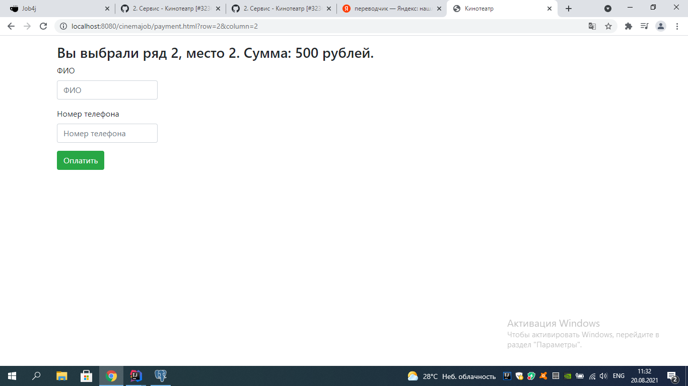
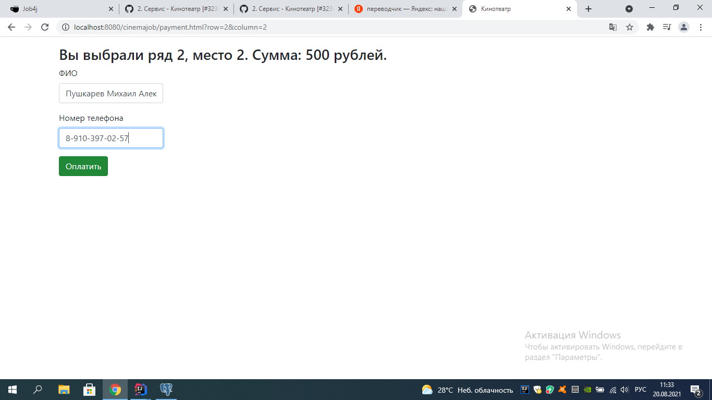
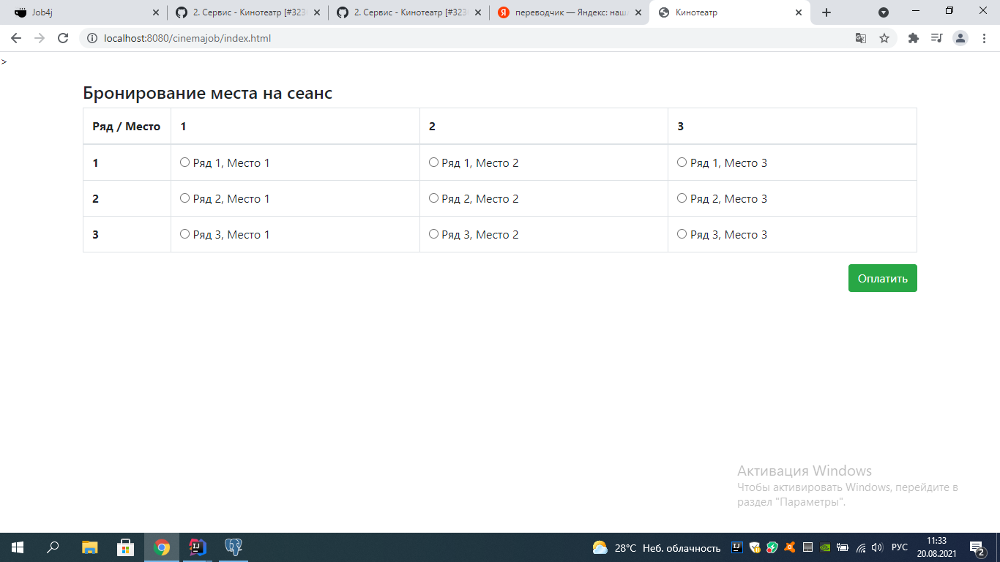

В впроекте я использовал следующий стэк технологий:
1 - JDBC
2 - Servlet
3 - HTML
4 - JQUERY
5 - AJAX
6 - JAVASCRIPT
7 - LOG4J

Описание: Проект кинотеатр открывает главную страницу с указанными местами для просмотра 
кинофильма, я выбираю удобное для меня место, далее кнопка оплата она же ссылка на следующую страницу
сервер обрабатывет и открывает страницу с оплатой моего места, далее ввожу свои данные
и оплачиваю.

